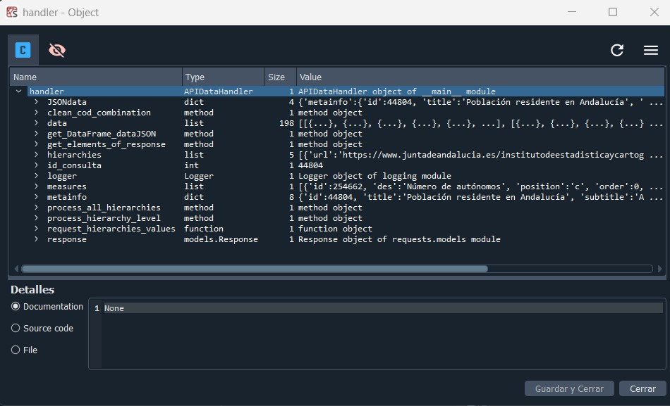
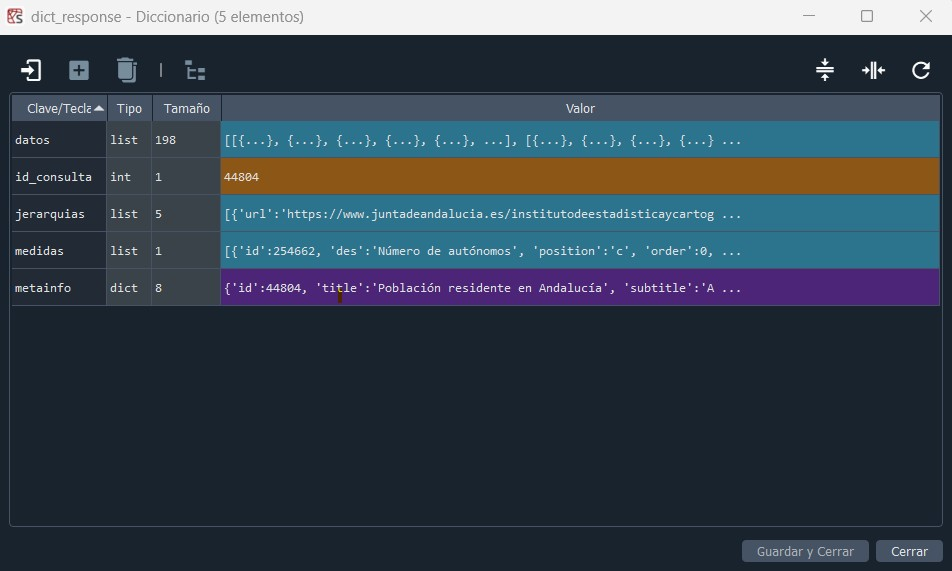
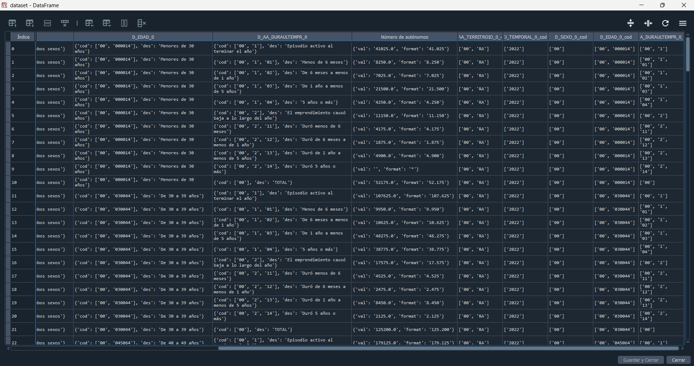
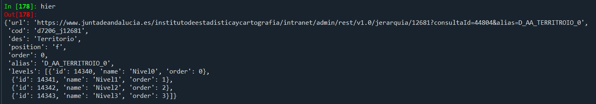
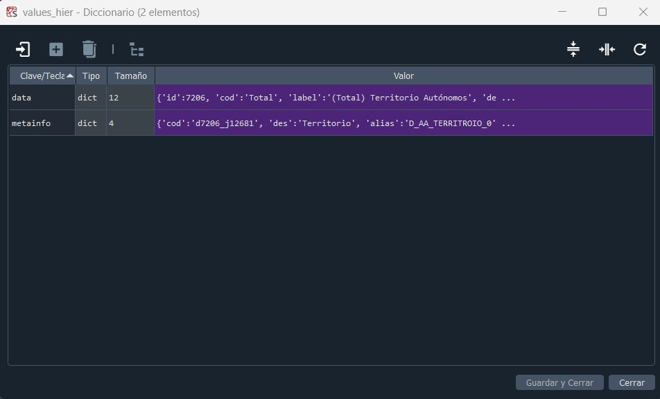
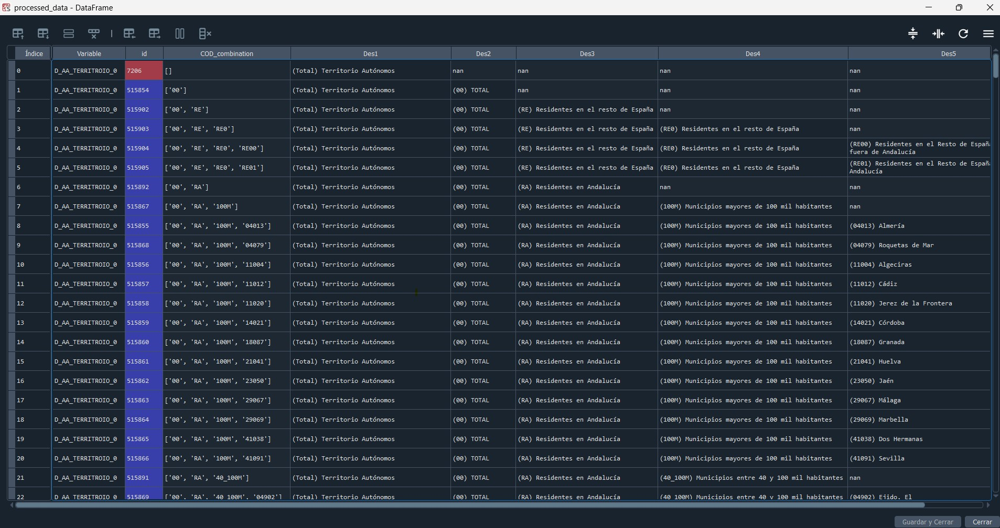

# Directorio de trabajo. 

+ `auxiliar_script/`: 
    + `aplanar_jerarquias.py` : fichero donde se realizó la generalización del aplanamiento de las jerarquías en dimensión 2D. 
    + `connection_IECA_auxiliar.py` : conjunto de acciones realizadas para entender la definición de la clase.
    + `datos_script_apoyo.py` : script de IECA_extractor que se ha utilizado como apoyo para la definición de la clase final y el tratamiento de la respuesta proporcionada por BADEA.
    + `def_class_for_response.py` : clase APIDataHandler en una versión beta, sin aplanamiento de las jerarquías, sólo con métodos de manejo de información.
    + `functions_BADEA.py` : recoge las funciones de la clase final en un único script.
    + `codigo_mapeo_jerarquia.py` : código utilizado para generalizar el método de mapeo de los datos y las jerarquías en cuestión. 
+ `class_APIDataHandler_complete.py` : modelo final de definición de clase con todos los métodos implementados. 
+ `examples.py` : casos de uso.

------------------------------------------------------------------------

# Class APIDataHandler. 

La clase `APIDataHandler` maneja el procesamiento y transformación de datos obtenidos tras una consulta a la API del Instituo Estadístico y Cartográfico de Andalucía (BADEA). Permite extraer, procesar, limpiar y organizar los datos en un `DataFrame` de Pandas para su posterior análisis. 

## 1. Métodos definidos en la clase. 

1. `__init__(self, response)` : 
    + **Descripción**: Este es el consultor de la clase. Toma como entrada una respuesta de la consulta a la API de BADEA, de forma que guarda su respuesta en JSON, y extrae los elementos clave de la misma para almacenarlos en atributos de la clase. 
    + **Parámetros**: 
        + `response` : obejto de respuesta de `requests.get` a la url de consulta de la API. 
    + **Atributos**: 
        + `self.response`: respuesta original de la API. Parámetro de entrada.
        + `self.JSONdata`: Copia de los datos JSON de la respuesta de la API. 
        + `self.hierarchies`: Información referente a las jerarquías extraídas de respuesta de la consulta. 
        + `self.data`: Datos prinicpales extraídos de la respuesta de la consulta.
        + `self.measures`: Medidas asociadas a los datos. 
        + `self.metainfo`: Información adicional sobre la consulta, ofrecida directamente en la respuesta de la misma. 
        + `self.id_consulta`: ID de la tabla consultada en la API.
        + `self.logger`: Configuración del registro de logs. 

2. `.get_elements_of_response(self)`: 
    + **Descripción**: Devuelve un diccionario con los elementos clave de la respuesta de la API. Facilita el conocimiento de la estructura de respuesta a consultas de la API. 
    + **Parámetros**:
        + No precisa de parámetros de entrada.
    + **Atributos**: 
        + No crea atributos de clase, se trata de facilitar la visualización de la respuesta. 
    + **Retorno**: 
        + Un diccionario con las claves `"jerarquias"`, `"medidas"`, `"metainfo"`, `"id_consulta"` y `"datos"`, correspondientes a los elementos de la respuesta. 

3. `.get_DataFrame_dataJSON(self)`: 
    + **Descripción**: Convierte los datos JSON en un `DataFrame` de Pandas, estructurado de acuerdo a las jerarquías (distintas desagregaciones) y a las medidas definidas en la respuesta. 
    + **Parámetros**: 
        + No precisa de parámetros de entrada. 
    + **Atributos** : 
        + `self.data_df`: data.frame estructurado de los datos de la respuesta según las columnas de jerarquías y las de medidas.
    + **Proceso** : 
        + Extrae los alias de las jerarquías y las descripciones de las medidas para usarlas como columnas del `DataFrame`. 
        + Añade columnas adiccionales que continenen los códigos (`cod`) de los valores de las jerarquías, si estos estuvieran disponibles. *En principio estos códigos deberían estar siempre disponibles.*
    + **Retorno**: 
        + Un `DataFrame` de Pandas con las columnas correspondientes a las jerarquías y las medidas, además de las columnas de códigos.

4. `.request_hierarchies_values(hierarchy_element)`:
    + **Descripción**: Realiza una solicitud HTTP a la URL de una jerarquía específica para obtener sus valores y su información. Está pensada para usarla dentro de otras funciones para aplanar las jerarquías, pero está como **método estático** para poder usarlo de manera individual sin necesidad de construir la clase, de esta forma si se precisa la consulta de alguna jerarquía en concreto es accesible. 
    + **Parámetros**: 
        + `hierarchy_element`: Diccionario que contiene a la URL de la jerarquía. Esto debe seguir la estructura de un elemento de `self.jerarquias`. 
    + **Atributos**:
        + No crea atributos de clase.
    + **Retorno**:
        + La respuesta JSON de la consulta al url de la jerarquía en cuestión. 

5. `.process_hierarchy_level(self, alias, node, cod_combination = None, descriptions = None, level = 1)`:
    + **Descripción**: Método recursivo para procesas los niveles de jerarquía de una jerarquía específica, construyendo la combinación de códigos y descripciones para cada nivel de forma que facilite el mapeo en el conjunto de datos final del que sacamos los valores "_cod" (`self.data_df`)
    + **Parámetros**:
        + `alias`: Alias de la jerarquía. Esto facilitará saber a qué columna de `self.data_df` está referidos los niveles de jerarquía, facilitando así el mapeo. 
        + `node`: Nodo actual de la jerarquía que se está procesando. 
        + `cod_combination`: Lista acumulativa de códgios (se va actualizando a medida que se procesan los niveles)
        + `descriptions`: Lista acumulativa de descripciones (valores que tomará la variable) (se va actualizando)
        + `level`: Nivel actual de la jerarquía que se está procesando. 
    + **Atributos**: 
        + `self.result_rows` : accede a este atributo creado en el método `.process_all_hierarchies()`.
    + **Proceso**:
        + La función recursivamente procesa cada nodo de la jerarquía, actualizando la combinación de códigos y descripciones hasta que se alcanza el último nivel de desagregación. 

6. `.process_all_hierarchies(self)`:
    + **Descripción**: Función principal que procesa todas las jerarquías y devuelve un `DataFrame` limpio, con toda la información relevante para el mapeo en `self.data_df` y conseguir el `DataFrame` final con los valores de categorías según las jerarquías en el método final. 
    + **Parámetros**:
        + No precisa de parámetros de entrada. 
    + **Atributos**:
        + `self.result_rows`: lista con diccionarios sobre las informaciones resultantes de cada paso del proceso recursivo. Esto erá útil para utilizar la función en todas las jerarquías a la vez. Estos elementos formarán el `DataFrame` final con la información referida a todas las jerarquías. Lo crea y rellena de forma recursiva haciendo uso del método recursivo de la clase `.process_hierarchy_level()`.
        + `self.hierarchies_info_df`: Resultado final sobre la información de las jerarquías utilizadas en los datos de respuestas de consultas.
    + **Proceso**:
        + Se recorren todas las jerarquías en la respuesta y se procesan de una en una. 
        + Para cada jerarquía, se obtienen los valores y se procesan gracias al método `.process_hierarchy_level()`.
        + Una vez procesas todas las jerarquías, se contruye un `DataFrame` a partir de las filas generadas. 
        + Se limpia la columna `COD_combination`, eliminando las combinaciones que en lugar de código de categoría contienen "Total" o "TOTAL" gracias al método `.clean_cod_combination` y su aplicación por filas. *Esto viene de que las jerarquías padres simplemente es información sobre la jerarquía y en lugar de tener un valor "cod" real, tienen un texto que hace referencia a TOTAL, y esto no es útil para el mapeo. Es más sencillo limpiar la columna que especificarlo en el análisis.*
        + Se genera el `DataFrame` final con la información de la jerarquía y se guarda/asigna como atributo de clase, para su acceso en posteriores métodos. 
    + **Retorno**:
        + Un `DataFrame` de Pandas con una estructura sencilla para el mapeo de códigos en el conjunto final de datos.
            + Columna `alias`: contiene el alias de la jerarquía a la que hace referencia los distintos niveles (mostrados por filas).
            + Columna `id`: id del nivel en cuestión tratado en la fila.
            + Columna `COD_combination`: lista con los códigos referentes al nivel del valor de la jerarquía, de forma que ofrece información de quién es el padre y del camino recorrido para llegar a dicho valor de nivel. 
            + Columnas `Des{i}`: Son los distintos valores categóricos de los grupos recorridos para llegar al último nivel. Está relacionado directamente con la combinación de códigos `COD_combination`. Toma el valor None cuando no hay un nivel de desagregación mayor a `i`. 

7. `.clean_cod_combination(self, cod_combination)`:
    + **Descripción**: Función que realmente no tiene interés en su acceso, se utiliza exclusivamente dentro del método `.process_all_hierarchies` para la limpieza de las combinaciones de códigos. 
    + **Parámetros**:
        + `cod_combination`: la combinación de código que se pretende limpiar. (lista)
    + **Atributos**:
        + No crea atributos de clase.
    + **Proceso**:
        + Elimina los valores de `cod_combination` que sean texto. 
    + **Retorno**:
        + La lista `cod_combination` sin los valores textos.

*FALTA LA IMPLEMENTACIÓN DEL MAPEO*

## 2. Flujo de trabajo. 

### 2.1. Inicialización.

Se crea una instancia de la clase APIDataHandler pasando la respuesta de la API. El constructor (`__init__`) extrae la información clave y la almacena en atributos de la clase. 

Para crear una instancia de la clase se precisa de proporcionarle la url a la tabla de IECA que se quiere obtener por consulta HTTPS desde la API de BADEA, y los parámetros, en forma de diccionario `params`, sobre el filtrado que se desea consultar. 

### 2.2. Obtener elementos de la respuesta. 

Se pueden obtener los elementos clave de la respuesta usando el método `.get_elements_of_response`, que devuelve un diccionario con las jerarquías, medidas, metainformación, etc.

### 2.3. Transformación de la clave de respuesta `"data"` a `DataFrame` de pandas. 

El método `.get_DataFrame_dataJSON` toma los datos de la respuesta y los convierte en un DataFrame de Pandas. Este DataFrame incluye tanto los datos estructurados como los códigos de las jerarquías, gracias a un proceso de extracción interno de los mismos. *Las columnas de código tendrán como sufijo `_cod`*. 

### 2.4. Procesar jerarquías. 

El método `.process_all_hierarchies` procesa todas las jerarquías, creando combinaciones de códigos y descripciones para el mapeo o la visualización de los valores posibles de los parámetros de consulta (correspondientes a la integración del valor `id` (siguiendo formato "{id_1},{id_2},{id_3}") en el parámetro de `params` deseado). También limpia la columna COD_combination eliminando valores no deseados para facilitar el mapeo. 

El resultado puede ser descargado en el formato deseado, y/o consultado mediante el atributo `self.hierarchies_info_df`, para la generación de nuevas consultas. Además el resultado es utilizado en el método final de aplanamiento en 2 dimensiones de los datos de consulta devueltos por BADEA. 

## 3. Casos de Uso. Ejemplos. 

Se puede ver el código en `examples.py`

```
url = "https://www.juntadeandalucia.es/institutodeestadisticaycartografia/intranet/admin/rest/v1.0/consulta/44804?"
# parámetros de consulta: 
params = {
    "D_TEMPORAL_0" : "180194",
    "AA_TERRITROIO_0" : "515892",
    "D_SEXO_0" : "3691,3689,3690",
    "posord" : "f[D_AA_TERRITROIO_0],f[D_TEMPORAL_0],f[D_SEXO_0],f[D_EDAD_0],f[D_AA_DURAULTEMPR_0],c[Measures]"
}

# Realizar request GET
response = requests.get(url, params = params)
```

1. Inicialización:

```
handler = APIDataHandler(response)
# <__main__.APIDataHandler at 0x18d4ff3fd70>
```



Acceso a los atributos iniciales de las clases: 

```
handler.response
handler.JSONdata
handler.hierarchies
handler.data
handler.measures
handler.metainfo
handler.id_consulta
```

2. Obtener elementos de la respuesta:

```
dict_response = handler.get_elements_of_response()
dict_response
```



```
dict_response["id_consulta"]
# 44804
```

3. Consulta de datos que devuelve BADEA tras la petición (handler.data), en formato DataFrame:

```
dataset = handler.get_DataFrame_dataJSON()
```



```
handler.df_data
```


4. Hacer petición a "url" de información de una de las jerarquías:

```
hier = handler.hierarchies[0]
values_hier = handler.request_hierarchies_values(hier)
```





5. Procesa las jerarquías llamando al método `process_all_hierarchies`:

```
processed_data = handler.process_all_hierarchies()
```



Guardar el dataframe resultante con `.to_excel()`

```
cleaned_data.to_excel("jerarquias_limpiadas.xlsx")
```