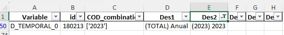

Para la conexión de la API a PowerBI se va a precisar del proyecto definido en la ruta padre de esta carpeta, pero aquí se recogen los instrumentos para la conexión puesot que son más específicos, pero el proyecto es funcional por sí solo. 

***

# Visualizar los datos en PowerBI. 

Para visualizar los datos recibidos tras una consulta a la API de BADEA, se precisa de un script de python que procese la consulta. Esto es debido al método de trabajo que tienenn en el Instituto Estadístico y Cartográfico de Andalucía, el cuál trabaja en "cubos". 

## Paso 1. Origen de datos en PowerBI. 

La clase definica en "src/main.py" como "APIHandlerData" es una clase que aplana la información, que de entrada está en cubos, en un formato de dos dimensiones (filas por columnas) el cuál es legible en PowerBI.  

Para hacer la conexión, el primer paso es establecer el origen de datos, para ello vamos a nuevo origen y buscamos la opción **Script de python**. 

Sale un despegable en el que copiaremos el script ubicado en esta carpeta "for_pbi.py". Este script realmente es la definición de la clase y la consulta y procesamiento de la respuesta. 

## Paso 1.1. Selección correcta de tabla a importar. 

Tal y cómo está definido el script para PowerBI, debemos cargar el objeto de python llamado "dataset". 

# Paso FINAL. Actualización anual de la consulta. 

Para este paso es para lo que se ha definido el método de guardado en excel de las jerarquías y las tablas relacionales de "id_ano.xlsx" o "id_curso_escolar.xlsx". 

Lo único que se debe hacer es agregar el "id" del año al que queremos actualizar en el diccionario params, si queremos actualizar la consulta para el año `2023`:

1. Buscar el "id" correspondiente a ese año en la tabla de excel relacional: 



2. Vamos a la consulta de PowerBI referida a esa tabla. 

3. Le damos a "Opciones" en el paso denominado "Origen". 

4. Se visualizará el script de origen de datos, entonces lo que tendremos que hacer es modificar `params`, diccionario que recoge los parámetros de la consulta, y mantener los códigos que ya aparecen pero añadir el de `2023`. Es decir: 

```python
# Sin 2023: 
params = {
    "D_TEMPORAL_0" : "180156,180175,180194",
    ....
}

# Con 2023:
params = {
    "D_TEMPORAL_0" : "180156,180175,180194,180213",
    ....
}

```